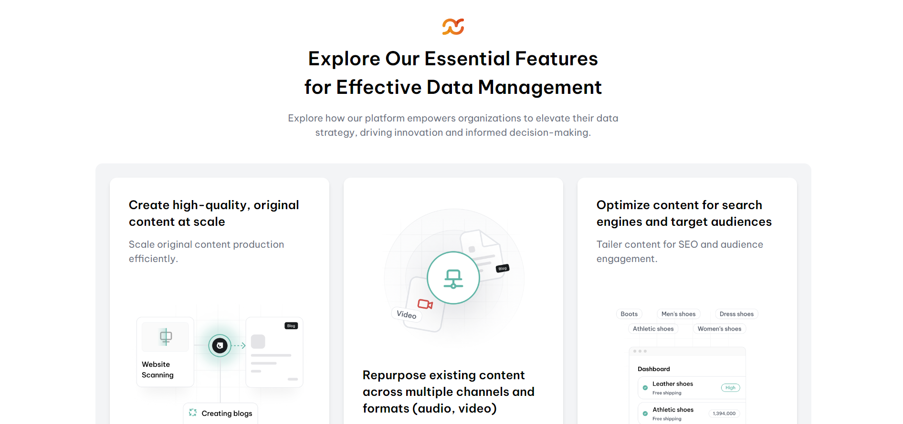

# Bento Box Layout Feature Section

Este proyecto es una sección de características en formato Bento Box, diseñada para resaltar las funciones clave de una plataforma de gestión de datos. Utiliza un diseño moderno, adaptable a diferentes dispositivos, con un enfoque en la presentación clara y accesible de la información.

## Vista Previa



Puedes ver la versión demo en vivo aquí: [Bento Box Layout Feature Section](https://ibrahim-003.github.io/Bento-Box-Layout-Feature-Section/)

## Características

- **Responsiva:** La página utiliza un diseño en cuadrícula flexible que se adapta a distintos tamaños de pantalla, gracias a Tailwind CSS.
- **Sección de Características:** Presenta cinco características clave de la plataforma, cada una con un encabezado, descripción y una imagen ilustrativa.
- **Imágenes Dinámicas:** Usa la etiqueta `<picture>` y `srcset` para cargar diferentes tamaños de imágenes según el ancho de la pantalla.
- **Tipografía Moderna:** Emplea la fuente "Be Vietnam Pro" para una experiencia visual limpia y profesional.
- **Paleta de Colores Personalizada:** La interfaz incluye colores como `slate-gray` y `light-gray` para un aspecto elegante y profesional.

## Estructura de Archivos

```
|-- index.html                # Página principal
|-- assets/
    |-- images/
    |   |-- Bentobox_challenge_logo.svg   # Logo del proyecto
    |   |-- image_1.png                   # Imagen para la primera característica
    |   |-- image_2.png                   # Imagen para la segunda característica
    |   |-- image_3.png                   # Imagen para la tercera característica
    |   |-- image_4.png                   # Imagen para la cuarta característica
    |   |-- image_5.png                   # Imagen para la quinta característica
```

## Instalación

1. Clona este repositorio en tu máquina local:
   ```bash
   git clone https://github.com/Ibrahim-003/Bento-Box-Feature-Section.git
   ```
2. Asegúrate de tener conexión a Internet para cargar las fuentes desde Google Fonts y Tailwind CSS.
3. Abre `index.html` en tu navegador para ver la página.

## Uso

Puedes personalizar esta sección modificando los estilos o la estructura en el archivo `index.html`. Ajusta el contenido de las características, cambia las imágenes o adapta el diseño según las necesidades del proyecto.

## Tecnologías Utilizadas

- HTML5
- Tailwind CSS
- Google Fonts

## Autor

Este proyecto fue creado por [Ibrahim Almeyda].
